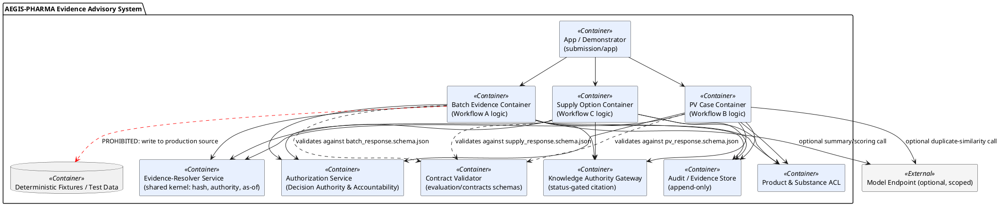

# C4 Level 2 — Containers (Prompt 06)

**Artifact status: `provisional`.**

## Diagram

## Container list and rationale

| Container | Responsibility | Bounded context | Waste it removes (from `04-ddd/dmaic_lens.md` §4) |
|---|---|---|---|
| App / Demonstrator | Frontstage UI — request form, evidence view, human-review action (`04_PRODUCT_SERVICE_BLUEPRINT.md` §3) | — (presentation only, no context logic) | — |
| Evidence-Resolver Service | Shared kernel: integrity hash, `as_of` stamping, source preservation | Evidence & Provenance | Extra-processing (INV-08; single implementation, not 3 copies) |
| Batch / PV / Supply Containers | Workflow-specific invariant/policy enforcement | Core contexts (one each) | Waiting/Motion (evidence assembly automated, not manual) |
| Product & Substance ACL | Identity resolution/flagging | Product & Substance Master | Defects (identity collision, INJ-008/045) |
| Knowledge Authority Gateway | Status-gated citation | Regulatory & Knowledge Authority | Retrieval waste (INJ-065 poisoned-doc class) |
| Authorization Service | Execution-time IAM check | Decision Authority & Accountability | — (security control, not waste-removal per se) |
| Audit / Evidence Store | Append-only audit trail | Evidence & Provenance | Observability waste (INJ-029 undetected gap) |
| Contract Validator | Schema conformance check | Cross-cutting | Defects (malformed output caught before reaching a human) |

## Prohibited write paths (explicit)

No container has a write path into any external source system (`c4_context.md`). The one PROHIBITED path drawn at this level (Batch → Fixtures) illustrates the general rule: even test/fixture data flows are one-directional into containers, never mutated by them, reinforcing INV-01/06/07.

## Degraded / offline mode (see also `boundary_and_degraded_mode.md`)

Per workflow continuity requirements (`09_REQUIREMENTS_TRACEABILITY.md` NFR-01/02): the Batch and Supply containers must be runnable in a Model-Endpoint-absent mode (rules/lookups only) for up to 14 days; the PV container must default to a manual-runbook-capable mode with zero tolerance for AI dependency, i.e. its core evidence-assembly function cannot depend on the Model Endpoint at all.

## Gen AI runtime sketch

The Model Endpoint is drawn external and optional. Only Batch (summary drafting) and PV (similarity scoring) containers have an edge to it, per `04-ddd/gen_ai_boundaries.md` §3's two-agent limit — Supply has no agent candidate at this stage (option generation is pure rules/lookup over `allocation_constraints.csv`-class data).
